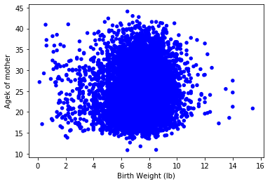

[Think Stats Chapter 7 Exercise 1](http://greenteapress.com/thinkstats2/html/thinkstats2008.html#toc70) (weight vs. age)

>> 
```
import first

live, firsts, others = first.MakeFrames()
live = live.dropna(subset=['agepreg', 'totalwgt_lb'])

thinkplot.Scatter(live.totalwgt_lb, live.agepreg, alpha=1)
thinkplot.Config(xlabel='Birth Weight (lb)',
                 ylabel='Agek of mother',
                 legend=False)
                 
np.corrcoef(live.totalwgt_lb, live.agepreg)

SpearmanCorr(live.totalwgt_lb, live.agepreg)
```



Pearson corr: ```0.06883397```
Spearman corr:```0.09461004109658228```

As you can see from the correlation coefficients and the scatterplot there is almost no correlation between birth weights and mother's age. 
